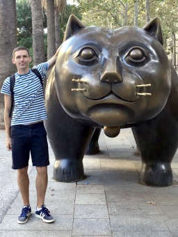

# Jiri Sedlar

<b>Thesis topics:</b>
<ul><li><a href="https://docs.google.com/document/d/1FO3kUAXlwcUQ2A1tldTQ4LO_Hu1KhOYqgQf7N6t9DO8/edit#heading=h.flrub2wha9cx">Analysis of Molecular Dynamic Simulations for Alzheimer’s Disease Research using VAMPnet Neural Networks</a></li>
<li><a href="https://docs.google.com/document/d/1FO3kUAXlwcUQ2A1tldTQ4LO_Hu1KhOYqgQf7N6t9DO8/edit#heading=h.vdj98nafglm3">Self-supervised learning for solving geometric construction problems from images</a></li>
<li><a href="https://ellis.ciirc.cvut.cz/4-students/">All thesis and internship topics at ELLIS Prague</a></li></ul>

E-mail: Jiri dot Sedlar at cvut dot cz
 
Office: <a href="https://goo.gl/maps/oP4URGXcyJW78HpX6">CIIRC</a> B-636 (<a href="http://impact.ciirc.cvut.cz/wp-content/uploads/2017/10/get-to-image003.gif">building B</a>, 6th floor)

Intelligent Machine Perception Project (<a href="http://impact.ciirc.cvut.cz">IMPACT</a>)
 
Czech Institute of Informatics, Robotics, and Cybernetics (<a href="https://www.ciirc.cvut.cz/">CIIRC</a>)
 
Czech Technical University in Prague

- 2017-present <a href="https://www.ciirc.cvut.cz/">Czech Technical University</a>, Prague, Czech Republic (Computer Vision and Machine Learning)
- 2014-2017 <a href="https://www.mayo.edu/">Mayo Clinic</a>, Rochester MN, USA (Medical Image Processing)
- 2013-2014 <a href="https://www.flinders.edu.au/">Flinders University</a>, Adelaide SA, Australia (Medical Image Analysis)
- PhD 2013 <a href="https://www.mff.cuni.cz/en">Charles University</a> / <a href="https://www.utia.cas.cz/">Czech Academy of Sciences</a>, Prague, Czech Republic (Computer Science)

Selected publications:
- <i>Z Li, J Sedlar, J Carpentier, I Laptev, N Mansard, J Sivic</i> <b>Estimating 3D Motion and Forces of Human-Object Interactions from Internet Videos</b> International Journal of Computer Vision (IJCV) (2022) - <a href="https://arxiv.org/pdf/2111.01591.pdf">PDF</a> - <a href="https://www.di.ens.fr/willow/research/motionforcesfromvideo/">Project page</a>
- <i>J Macke, J Sedlar, M Olsak, J Urban, J Sivic</i> <b>Learning to solve geometric construction problems from images</b> Conference on Intelligent Computer Mathematics (CICM) (2021) - <a href="https://arxiv.org/pdf/2106.14195.pdf">PDF</a> - <a href="https://data.ciirc.cvut.cz/public/projects/2021GeometryReasoning/">Project page</a>
- <i>Z Li, J Sedlar, J Carpentier, I Laptev, N Mansard, J Sivic</i> <b>Estimating 3D Motion and Forces of Person-Object Interactions From Monocular Video</b> IEEE Conference on Computer Vision and Pattern Recognition (CVPR) (2019) - <a style="color: Red;" href="https://www.ciirc.cvut.cz/vysledek-ciirc-cvut-se-dostal-do-uzsiho-vyberu-nejlepsich-clanku-prestizni-konference-cvpr-v-pocitacovem-videni/">Best paper finalist</a> - <a href="https://arxiv.org/pdf/1904.02683.pdf">PDF</a> - <a href="https://www.di.ens.fr/willow/research/motionforcesfromvideo/">Project page</a>
- <i>H Taira, I Rocco, J Sedlar, M Okutomi, J Sivic, T Pajdla, T Sattler, A Torii</i> <b>Is This the Right Place? Geometric-Semantic Pose Verification for Indoor Visual Localization</b> IEEE International Conference on Computer Vision (ICCV) (2019) - <a href="http://arxiv.org/abs/1908.04598">PDF</a> - <a href="http://www.ok.sc.e.titech.ac.jp/res/RIGHTP/">Project page</a>
- <i>Z Akkus, I Ali, J Sedlar, J P Agrawal, I F Parney, C Giannini, B J Erickson</i> <b>Predicting Deletion of Chromosomal Arms 1p/19q in Low-Grade Gliomas from MR Images Using Machine Intelligence</b> Journal of Digital Imaging (2017) - <a href="https://www.ncbi.nlm.nih.gov/pmc/articles/PMC5537096/pdf/10278_2017_Article_9984.pdf">PDF</a>
- <i>Z Akkus, J Sedlar, L Coufalova, P Korfiatis, T L Kline, J D Warner, J Agrawal, B J Erickson</i> <b>Semi-automated segmentation of pre-operative low grade gliomas in magnetic resonance imaging</b>  Cancer Imaging (2015) - <a href="https://cancerimagingjournal.biomedcentral.com/track/pdf/10.1186/s40644-015-0047-z">PDF</a>
- <i>A Novozamsky, J Sedlar, A Zita, F Sroubek, J Flusser, J G Svec, J Vydrova, B Zitova</i> <b>Image analysis of videokymographic data</b> IEEE International Conference on Image Processing (ICIP) (2015) - <a href="https://ieeexplore.ieee.org/stamp/stamp.jsp?tp=&arnumber=7350763">PDF</a>
- <i>M Caon, J Sedlar, M Bajger, G Lee</i> <b>Computer-assisted segmentation of CT images by statistical region merging for the production of voxel models of anatomy for CT dosimetry</b>  Australasian Physical & Engineering Sciences in Medicine (2014) - <a href="https://link.springer.com/content/pdf/10.1007/s13246-014-0273-x.pdf">PDF</a>
- <i>J Sedlar, B Zitova, J Kopecek, J Flusser, T Todorciuc, I Kratochvilova</i> <b>Automatic determination of the size of elliptical nanoparticles from AFM images</b> Journal of Nanoparticle Research (2013) - <a href="https://link.springer.com/content/pdf/10.1007/s11051-013-1842-8.pdf">PDF</a>
